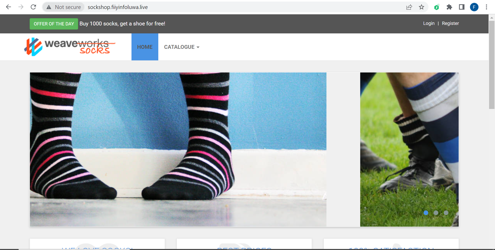
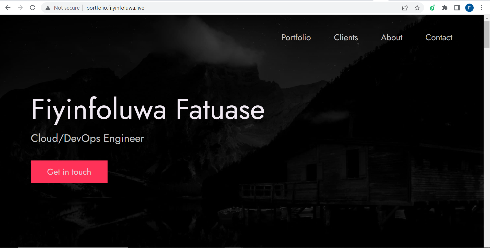
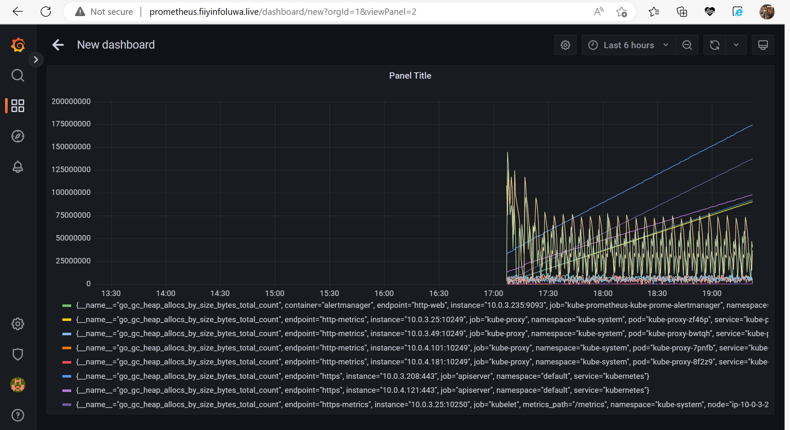
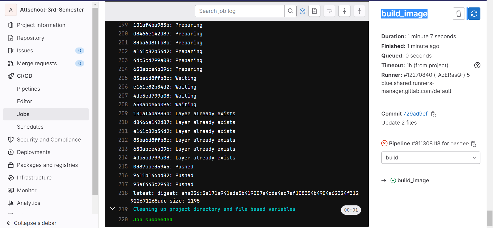

# Altschool-3rd-Semester

## Deploy SockShop microservices app and Portfolio on Kubernetes

### Prerequisites

- AWS account
- Terraform
- GitLab account

### SockShop Microservices App

### Portfolio App

### Grafana Dashboard

### Pipeline

Stage: Build
Build stage is used to build the docker images for the microservices and portfolio app.

Stage: Provision and Deploy

Deploy stage is used to provision Kubernetes Infrastructure and deploy the microservices and portfolio app on Kubernetes.

 

Stage: Clean stage is used to destroy the Kubernetes Infrastructure.

#### ./sockshop-servicepoint Folder

This folder conntains microservices servicepoint files for the sockshop app.

#### ./modules Folder

This folder contains the terraform modules for the Terraform provision.

#### ./Let's Encrypyt Folder

This folder contains the terraform files for the Let's Encrypt provision.

#### ./portfolio Folder

This folder contains the portfolio app files and dockerfile.
